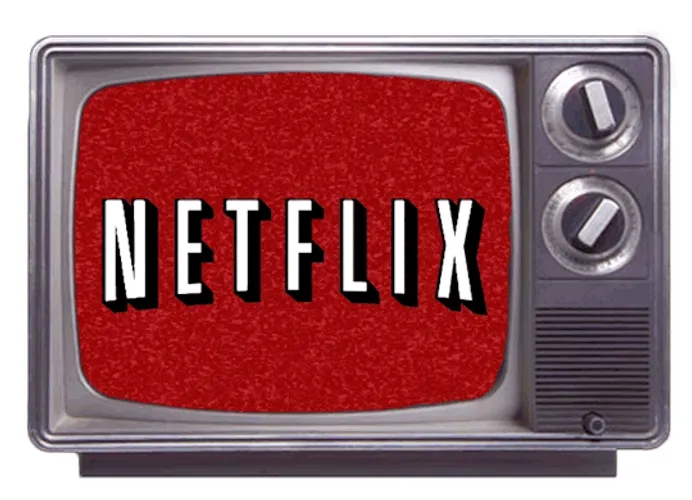

⚠️ Este é um projeto de cunho educacional, desenvolvido para o <a href="https://7daysofcode.io/">**7 Days of Code da Alura**</a>  pela instrutora <a href="https://github.com/fernandadegolin"> Fernanda Degolin </a>.

# 7 Days of Code - Alura: HTML e CSS

## Objetivo

Recriar a página inicial da Netflix utilizando o HTML e CSS. 

## Desafio

Criar a página parte por parte e, no final, ter a estrutura completa da página inicial de navegação da Netflix nos moldes do layout <a href="https://www.figma.com/file/boX9zUOYGNRuadqPh4JwwE/Alura?type=design&node-id=0%3A1&mode=dev">Figma</a> disponibilizado.  

 

**Tecnologias**
- HTML
- CSS

### Dia 1

**Objetivo**
 
Desenvolver o banner de destaque da página da Netflix.

### Dia 2

**Objetivo**
 
Desenvolver o menu de navegação do site.

### Dia 3

**Objetivo**
 
Criar o trilho de “Minha lista”.

### Dia 4

**Objetivo**
 
Crie uma feature para destacar algum item quando o mouse está sobre o mesmo.